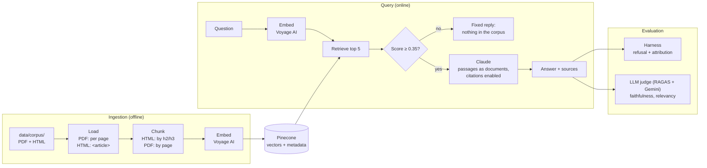

# Secure RAG

A security assistant built on RAG + guardrails, over an OWASP and NIST corpus.
It answers questions about security policies, controls and best practices,
citing the source document and passage.

## Stack

- Python 3.12
- Claude API (Anthropic) for generation — Claude Haiku 4.5 during development
- Voyage AI for embeddings (Anthropic's recommended partner — Claude has no
  embeddings endpoint of its own)
- Pinecone (free tier) as the vector database

## Setup

1. Create and activate the venv, then install the dependencies:
   ```
   python -m venv .venv
   source .venv/Scripts/activate   # Linux/macOS: source .venv/bin/activate
   pip install -r requirements.txt
   ```
2. Copy `.env.example` to `.env` and fill in the keys:
   - `ANTHROPIC_API_KEY` — console.anthropic.com
   - `VOYAGE_API_KEY` — dash.voyageai.com (free tier available)
   - `PINECONE_API_KEY` — app.pinecone.io (free tier)
   - `GEMINI_API_KEY` — aistudio.google.com (free tier; only for the evaluation judge)
3. Put the source documents in `data/corpus/` (see the README inside)
4. Run the ingestion: `python -m src.ingestion.ingest`
5. Ask a question: `python -m src.retrieval.query "your question"`

## Architecture



### Corpus
Three sources, chosen to cover two document styles at a manageable size
(Pinecone/Voyage free tiers):
- **OWASP Top 10 for LLM Applications 2025** — aligned with the case (prompt
  injection, sensitive information disclosure) and the basis for the attack
  tests in the security layer. Each risk (LLM01…LLM10) is a well-delimited section.
- **OWASP Top 10:2021 (web)** — 10 categories with a repeated structure; gives
  volume and variety for the test questions.
- **NIST CSF 2.0** (~30 pages) — Function › Category › Subcategory hierarchy;
  the ID (e.g. `PR.AA-01`) becomes an exact citation.


